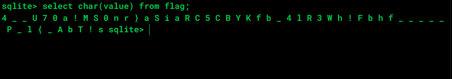
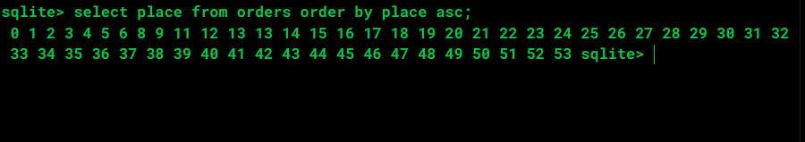

# [S4CTF 2021](https://s4ctf.peykar.io):ninidibi

**Category:** miscellaneous

**Description:** let's shuffle it!

We are given a file called `ninidibi` 

## solution overview

We don't know what the file type is so let's run this command:
```bash
file ninidibi
```
and the result is:
```bash
ninidibi: data
```
hmmm not useful though:(

Ok let's try [binwalk](https://github.com/ReFirmLabs/binwalk) maybe it can help us:

```bash 
binwalk ninidibi
```

the result is:
```bash
DECIMAL       HEXADECIMAL     DESCRIPTION
--------------------------------------------------------------------------------
```
Nothing!

at this point we can guess there is something wrong with the file signature so let's just see the binary data:
```bash
hexdump -C ninidibi
```
And the result:
```bash
00000000  20 66 6f 72 6d 61 74 20  33 00 10 00 01 01 00 40  | format 3......@|
00000010  20 20 00 00 00 03 00 00  00 03 00 00 00 00 00 00  |  ..............|
00000020  00 00 00 00 00 02 00 00  00 04 00 00 00 00 00 00  |................|
00000030  00 00 00 00 00 01 00 00  00 00 00 00 00 00 00 00  |................|
00000040  00 00 00 00 00 00 00 00  00 00 00 00 00 00 00 00  |................|
00000050  00 00 00 00 00 00 00 00  00 03 00 2e 3f d9 0d 00  |............?...|
00000060  00 00 02 0f 8c 00 0f c9  0f 8c 00 00 00 00 00 00  |................|
00000070  00 00 00 00 00 00 00 00  00 00 00 00 00 00 00 00  |................|
*
00000f80  00 00 00 00 00 00 3b 02  06 17 19 19 01 53 74 61  |......;......Sta|
00000f90  62 6c 65 6f 72 64 65 72  73 6f 72 64 65 72 73 03  |bleordersorders.|
00000fa0  43 52 45 41 54 45 20 54  41 42 4c 45 20 6f 72 64  |CREATE TABLE ord|
00000fb0  65 72 73 20 28 70 6c 61  63 65 20 49 4e 54 45 47  |ers (place INTEG|
00000fc0  45 52 29 35 01 06 17 15  15 01 4f 74 61 62 6c 65  |ER)5......Otable|
...
```
this is the first lines of the file content. at first glance you can guess this is related to a DB file because of that `CREATE TABLE ...` line(although the file name speak for itself:)). considering the file size we can guess this file is a SQLite database file. so let's check it out.

SQLite file signature:
```text
hex: 53 51 4C 69 74 65 20 66 6F 72 6D 61 74 20 33 00           Sizet:    16 Bytes
ASCII: SQLite format 3                                         Offset:  0 Bytes	
•	
```

Yeah we guessed right as you can see the first 6 bytes is missing in file signature so let's just fix it and run the `file` command again:

```bash
ninidibi: SQLite 3.x database, last written using SQLite version 3031001

```
Ok let's open it with `sqlite3` command:


as you can see we have 2 tables here `flag` and `orders` let's see the table contents:


at first sight it is obvious that the flag table contains some ascii codes but we don't know yet what contents of orders table mean so let's just convert those ascii codes to string:



Ok the flag characters is shuffled. so how do we rearrenge them again? this is where orders table comes into play. the orders table contains `53` numbers (the flag length - 1 we'll see why soon) which shows the actuall place of each character in flag table. for ex. character `4` belongs to 12th position, `_` belongs to 11th position and so on.

but there is one gotcha here. let's sort content of orders table:



As you can see we have some numbers between `0` and `53`. but the number `7` and `10` is missing and number `13` is repeated twice. so how are we supposed to know which positions these three numbers belong? to know this let's just rearrange the characters by that incomplete order using the script below.

```python
 
flag = '4 _ _ U 7 0 a ! M S 0 n r } a S i a R C 5 C B Y K f b _ 4 l R 3 W h ! F b h f _ _ _ _ _ P _ l { _ A b T ! s'
places = '12 11 38 25 31 7 48 51 37 21 14 17 15 53 35 0 19 43 32 2 18 20 6 9 28 30 8 23 1 42 36 16 34 44 50 4 46 49 13 13 22 40 29 45 39 33 47 5 24 26 41 3 52 27'

flag = flag.split(' ')
places = places.split(' ')

for i in range(54):
    if(str(i) in places):
        print(flag[places.index(str(i))])

```
and the result is:

```text
a_Rb!lCfB_4hSnR0CS5M_b{U_!Y_K7aP3}l!___A4iW_F_0bhaTr
```
hmm that was predictable :|

## so how this is gonna help us?

in those two arrays Look at the character which belongs to position `0` yeah it's `a`. now look at the character placed right next to the `a` it is `S` so as you might guess there is one tiny gap here. one of the missing numbers must be placed right before the `0` in places array. at this point you can do the trial and error approach btw let's just place `7` number at position 0 of places array. the result of the script is:
```text
S4CTF{B4bY__f0r3n5iCS___7AsK_f0R_WaRMUP_blah_blah!!!}
```
Lucky us! but what about `10`? look at the characters at index `38` and `39` of flag array i mean `f` and `_` which of these characters belong to position `10` of the flag? i hope you guessed right yeah `_` (if you look at the flag three `_` are following each other right?). finally by fixing this position and running the script above again:

## Flag
the flag is:`S4CTF{B4bY___f0r3n5iCS___7AsK_f0R_WaRMUP_blah_blah!!!}`
