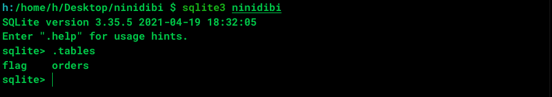
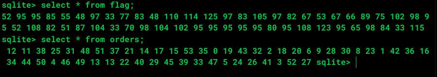

# [S4CTF 2021](https://s4ctf.peykar.io):ninidibi

**Category:** miscellaneous

**Description:** let's shuffle it!

We are given a file called `ninidibi` 

## solution overview

We don't know what the file type is so let's run this command:
```bash
file ninidibi
```
and the result is:
```bash
ninidibi: data
```
hmmm not useful though:(

Ok let's try [binwalk](https://github.com/ReFirmLabs/binwalk) maybe it can help us:

```bash 
binwalk ninidibi
```

the result is:
```bash
DECIMAL       HEXADECIMAL     DESCRIPTION
--------------------------------------------------------------------------------
```
Nothing!

at this point we can guess there is something wrong with the file signature so let's just see the binary data:
```bash
hexdump -C ninidibi
```
And the result:
```bash
00000000  20 66 6f 72 6d 61 74 20  33 00 10 00 01 01 00 40  | format 3......@|
00000010  20 20 00 00 00 03 00 00  00 03 00 00 00 00 00 00  |  ..............|
00000020  00 00 00 00 00 02 00 00  00 04 00 00 00 00 00 00  |................|
00000030  00 00 00 00 00 01 00 00  00 00 00 00 00 00 00 00  |................|
00000040  00 00 00 00 00 00 00 00  00 00 00 00 00 00 00 00  |................|
00000050  00 00 00 00 00 00 00 00  00 03 00 2e 3f d9 0d 00  |............?...|
00000060  00 00 02 0f 8c 00 0f c9  0f 8c 00 00 00 00 00 00  |................|
00000070  00 00 00 00 00 00 00 00  00 00 00 00 00 00 00 00  |................|
*
00000f80  00 00 00 00 00 00 3b 02  06 17 19 19 01 53 74 61  |......;......Sta|
00000f90  62 6c 65 6f 72 64 65 72  73 6f 72 64 65 72 73 03  |bleordersorders.|
00000fa0  43 52 45 41 54 45 20 54  41 42 4c 45 20 6f 72 64  |CREATE TABLE ord|
00000fb0  65 72 73 20 28 70 6c 61  63 65 20 49 4e 54 45 47  |ers (place INTEG|
00000fc0  45 52 29 35 01 06 17 15  15 01 4f 74 61 62 6c 65  |ER)5......Otable|
...
```
You can see first lines of the file content. at first glance you can guess this is related to a DB file(although the file name speak for itself:) 
because of that `CREATE TABLE ...` line. considering the file size we can guess this file is a SQLite database file. so let's check it out.

SQLite file signature:
```text
hex: 53 51 4C 69 74 65 20 66 6F 72 6D 61 74 20 33 00           Sizet:    16 Bytes
ASCII: SQLite format 3                                         Offset:  0 Bytes	
•	
```

Yeah we guessed right as you can see the first 6 bytes is missing in file signature so let's just fix it and run the `file` command again:

```bash
ninidibi: SQLite 3.x database, last written using SQLite version 3031001

```
Ok let's open it with `sqlite3` command and see how many tables we have:



as you can see we have 2 tables here `flag` and `orders` let's see the table contents:




